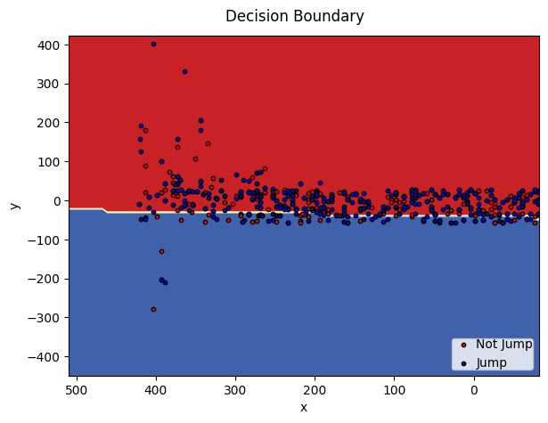
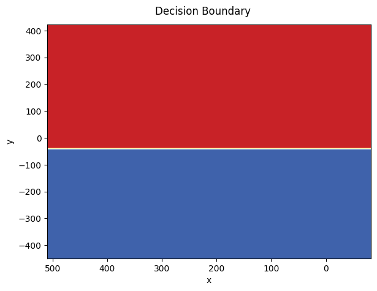

<h1>SOLVING FLAPPY BIRD WITH SUPERVISED LEARNING</h1>

## Implementing the Game

The game was implemented using the pygame library for the interface and it uses the artwork from a variation of the original Flappy Bird called Flappy Bean and made available online according to references. The game has three screens explained below:

<p align="center"> 
    
</p>
  
The initial screen displays a bean that jumps whenever it reaches the middle height of the screen and an image of a hand indicating that the actions of clicking on it or pressing space start the game. It also has a **Share** button that takes you to the game's github repository.

<p align="center"> 
    
</p>

After starting the game, the pipes start to appear at different heights on the screen, prompting the player to move to each corresponding gap to continue the game. The only movement allowed to the player is to make the bird jump by clicking the space key.

<p align="center"> 
    
</p>

If the bean collides with the sky, ground or one of the pipes, the player loses the match and the interaction with the bean ends. At this point, the player can restart the game by pressing space or clicking **Ok** and can return to the initial screen by clicking **Menu**.

## Intelligent Agent Strategies

To address this problem, the supervised learning approach was used, more specifically, the techniques of logistic regression, decision tree and support vector machine. As a first step, game play data was captured as the bean was successful in getting past a pipe:

<p align="center"> 
    
</p>

When balancing the samples we are left with the following set of data:

<p align="center"> 
    
</p>

As the collected data is limited to the game screen, it is presented in a well-defined way with the only difference being the x-axis which is mirrored in relation to the real game. As we tested the models in the game environment itself, the data was not split between training and testing sets.

When training the logistic regression model, we obtained a decision boundary that describes a straight line that fits the data and proved to be invincible when put to play the game:

<p align="center"> 
    
</p>

When training a decision tree, we must first keep in mind that it cuts the data from each node and that these are parallel to the variable axes. When observing the decision boundary and understanding it in a less fragmented way than it is presented, we realize that the main cutoff that defines between jumping or not jumping is close to 0 on the axis of the vertical distance that represents the center of the gap between the pipes:

<p align="center"> 
    
</p>

Interpreting the result of the decision tree, we realize that the bean always wants to get closer to the height of the center of the gap between the pipes and stay there. Therefore, when recovering the importance of the variables, we found that the vertical distance has 97% relevance for reducing entropy in the data.

In the end, we got two invincible models in the game. Next, a gif is displayed with the execution of one of the ML models in the game environment:

<p align="center"> 
    
</p>

## Flappy Bean Pack Organization
```
flappy_bean/                         Top-level package
      __init__.py
      constants.py
      bean.py
      pipe.py
      base.py
      flappy_bean.py                 It brings together the functionalities of the modules to implement the game
      media/                         Folder with the files used in the game's interface
              ...
      models/                        File with the trained ML models
              log_reg.pkl
              dtc.pkl          
      data/
              flight_bean.csv        Data collected from game matches
```
## Running the Game

Using Windows OS and make sure you have [Python 3](https://www.python.org/) installed.

Clone the project:

```bash
  git clone https://github.com/filipemedeiross/solving_flappy_bird_with_supervised_learning.git
```

Access the project directory:

```bash
  cd solving_flappy_bird_with_supervised_learning
```

Creating a virtual environment (for the example we use the location directory parameter as `.venv`):

```bash
  python -m venv .venv
```

Activating the virtual environment:

```bash
  .venv\Scripts\activate
```

Install all required packages specified in requirements.txt:

```bash
  pip install -r requirements.txt
```

Use the following command to run the game:

```bash
  python main.py
```
## References

Wilmott, Paul. Machine Learning - An Applied Mathematics Introduction. Panda Ghana Publishing, 2019.

Images used: <https://opengameart.org/>

Pygame: <https://www.pygame.org/docs/>

Sklearn: <https://scikit-learn.org/stable/modules/classes.html>
